# Auditoría de estandarización visual de NooVDB

> Estado: propuesta de corrección, sin cambios sobre la interfaz real
>
> Fecha de auditoría: 6 de septiembre de 2026
>
> Viewports comprobados con Chromium: `1440 × 1024`, `820 × 1180` y `390 × 844`
>
> Revisión 1.1: bento obligatorio en toda la ficha y Golden basado en un reflejo de tres haces

## 1. Veredicto ejecutivo

NooVDB ya tiene una identidad reconocible —lienzo oscuro, blanco cálido, violeta y tipografía condensada—, pero no funciona todavía como un sistema único. La desviación principal no es estética: cada ruta recompone por su cuenta el shell, la cabecera, los paneles, los radios, los breakpoints y parte de la paleta. El resultado se percibe como varias interfaces compatibles, no como una sola aplicación.

Mi recomendación es corregir primero el sistema operativo actual, conservando `theme.css`, y posponer la migración de `DESIGN.md` hasta que se apruebe explícitamente. El orden correcto es:

1. Resolver los defectos verificables de móvil, accesibilidad y Game Card Golden.
2. Unificar el shell, la jerarquía de página y los estados compartidos con los tokens actuales.
3. Reducir valores visuales literales y breakpoints duplicados por dominio.
4. Solo después, activar la migración futura de tipografía, tokens `--ds-*` y componentes descritos en `DESIGN.md`.

### Diagnóstico cuantitativo

El inventario estático actual contiene:

- 49 hojas CSS bajo `src/`.
- 600 apariciones de color hexadecimal y 440 valores hexadecimales distintos, incluyendo `theme.css`.
- 401 declaraciones de `border-radius` con 40 valores distintos.
- 530 declaraciones de `font-size` con 158 valores distintos.
- 127 media queries agrupadas en 32 expresiones diferentes.
- Ninguna propiedad real con `!important` y ninguna transición `transition: all`; ambos son puntos sanos que conviene preservar.

Estas cifras no prueban por sí solas que cada valor sea erróneo. Sí demuestran que `theme.css` no está actuando aún como fuente única de verdad en toda la interfaz.

## 2. Jerarquía de fuentes y límites de esta auditoría

| Nivel | Fuente | Uso en esta auditoría |
|---|---|---|
| 1 | `src/styles/theme.css` | Fuente operativa para color, tipografía, radios y comportamiento actual. Sus valores prevalecen en todos los mockups correctivos. |
| 2 | Interfaz real en Chromium y patrones dominantes del repositorio | Evidencia para detectar incoherencias entre rutas y estados. |
| 3 | `DESIGN.md` | Dirección futura. El propio documento se declara “borrador de dirección visual 2.2” y no normativo hasta aprobar el mockup. Sus decisiones no se mezclan con las correcciones operativas. |
| 4 | Referencias externas de foil | Solo material óptico para la Game Card Golden. No definen el resto de NooVDB. |

La auditoría no modifica componentes, APIs ni datos. Todos los archivos visuales marcados como **PROPUESTA** son mockups de decisión, no capturas de una implementación existente.

## 3. Cobertura comprobada

### 3.1 Rutas

| Nº | Ruta / flujo | Evidencia | Estado de salud |
|---:|---|---|---|
| 1 | Catálogo `/` | [desktop](docs/design-standardization/assets/01-catalog-desktop-current.png), [tablet](docs/design-standardization/assets/03-catalog-tablet-current.png), [móvil](docs/design-standardization/assets/02-catalog-mobile-current.png) | **Atención**: buen lenguaje de card, shell y controles excesivamente fragmentados. |
| 2 | Ficha `/games/league-of-legends/` | [desktop](docs/design-standardization/assets/04-detail-desktop-current.png), [tablet](docs/design-standardization/assets/32-detail-tablet-current.png), [móvil](docs/design-standardization/assets/10-detail-mobile-current.png) | **Atención**: el bento actual es una fortaleza obligatoria; debe conservarse al unificar la navegación y el shell. |
| 3 | Ruleta `/ruleta/` | [desktop](docs/design-standardization/assets/05-roulette-desktop-current.png), [tablet](docs/design-standardization/assets/33-roulette-tablet-current.png), [móvil](docs/design-standardization/assets/11-roulette-mobile-current.png) | **Atención**: la ruleta tiene protagonismo correcto; el shell cambia y la navegación tapa controles en tablet/móvil. |
| 4 | Estadísticas `/estadisticas/` | [desktop](docs/design-standardization/assets/06-statistics-desktop-current.png), [tablet](docs/design-standardization/assets/34-statistics-tablet-current.png), [móvil](docs/design-standardization/assets/12-statistics-mobile-current.png) | **Atención**: datos legibles; exceso de colores decorativos y geometría propia. |
| 5 | Alias `/criterio/` | [resultado de la navegación](docs/design-standardization/assets/07-criterion-desktop-current.png) | **Sano**: el código devuelve un `301` a `/criticas/`; no es una segunda interfaz que mantener. |
| 6 | Metacrítica `/criticas/` | [desktop](docs/design-standardization/assets/08-reviews-desktop-current.png), [tablet](docs/design-standardization/assets/35-reviews-tablet-current.png), [móvil](docs/design-standardization/assets/13-reviews-mobile-current.png) | **Atención**: jerarquía editorial clara; métricas y cabecera no siguen el mismo shell que el catálogo. |
| 7 | Datos pendientes `/datos-pendientes/` | [desktop](docs/design-standardization/assets/09-pending-desktop-current.png), [tablet](docs/design-standardization/assets/36-pending-tablet-current.png), [móvil](docs/design-standardization/assets/14-pending-mobile-current.png) | **Crítico en móvil**: contenido recortado, navegación superpuesta y un `select` sin nombre accesible. |

### 3.2 Estados compartidos

| Estado | Evidencia actual | Resultado |
|---|---|---|
| Navegación desktop/tablet/móvil | Capturas de las siete rutas y [drawer móvil](docs/design-standardization/assets/16-mobile-drawer-current.png) | Cubierto. |
| Filtros | [Catálogo con filtros](docs/design-standardization/assets/15-catalog-filters-desktop-current.png) y Datos pendientes | Cubierto. |
| Diálogo | [Autenticación del editor](docs/design-standardization/assets/18-editor-auth-dialog-current.png) | Cubierto; patrón recomendable. |
| Hover de card | [Game Card estándar](docs/design-standardization/assets/19-card-standard-hover-current.png) | Cubierto. |
| Golden / foil | [centro](docs/design-standardization/assets/20-golden-current-center.png), [arriba izquierda](docs/design-standardization/assets/21-golden-current-top-left.png), [abajo derecha](docs/design-standardization/assets/22-golden-current-bottom-right.png) | Cubierto mediante estado técnico forzado; no hay cards Golden reales en los datos actuales. |
| Vacío | [Catálogo móvil sin resultados](docs/design-standardization/assets/17-catalog-empty-mobile-current.png) | Cubierto. |
| Carga | No existe un estado de carga compartido ni un `aria-busy` de página que pueda capturarse | La ausencia es un hallazgo; se propone un patrón acotado. |
| Responsive | 1440, 820 y 390 | Cubierto para cada superficie visual única; `/criterio/` solo redirige. |

## 4. Índice de hallazgos

| Prioridad | ID | Familia | Hallazgo | Esfuerzo |
|---|---|---|---|---|
| Alta | A1 | Shell y navegación | La geometría, marca y jerarquía principal cambian entre rutas. | L |
| Alta | A2 | Responsive / accesibilidad | Datos pendientes recorta contenido en 390 px y su filtro carece de nombre accesible. | S |
| Alta | A3 | Game Card Golden | El único haz actual necesita convertirse en un reflejo óptico de un haz principal y dos secundarios. | M |
| Alta | A4 | Tokens | Los estilos de página introducen cientos de valores literales fuera de `theme.css`. | L |
| Alta | A5 | Cards y hero | La transición entre imagen y superficie reaparece como corte duro pese a existir `--card-body-fade`. | S |
| Media | M1 | Controles y feedback | El catálogo duplica mecanismos de filtro/conteo y el estado vacío es débil. | M |
| Media | M2 | Datos y métricas | Las tarjetas métricas usan colores funcionales como decoración y pierden jerarquía común. | M |
| Media | M3 | Responsive | Hay demasiados breakpoints y reglas de clearance para una misma navegación fija. | L |
| Media | M4 | Ficha y módulos | El bento debe sistematizarse y mantenerse protagonista en Horas, Dinero, Rango, Detalles y Valoración. | M |
| Media | M5 | Carga y error | No hay contrato visual compartido para carga diferida, guardado o error recuperable. | M |
| Baja | B1 | Tipografía | Las familias están tokenizadas, pero el tamaño y tracking se redefinen con demasiada granularidad. | M |
| Baja | B2 | Diálogos | El diálogo de autenticación ya es coherente; debe convertirse en patrón, no rediseñarse. | S |

Leyenda de esfuerzo: **S** = cambio localizado; **M** = varios selectores/componentes; **L** = refactor transversal.

## 5. Hallazgos por familia

### 5.1 Shell, navegación y cabecera — A1, M3

#### Captura actual

| Catálogo desktop | Estadísticas desktop |
|---|---|
| 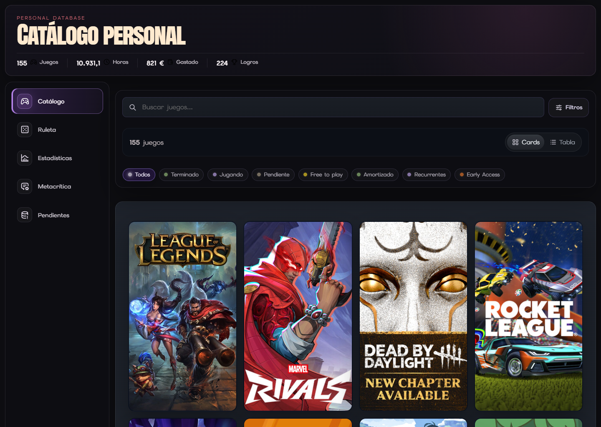 | 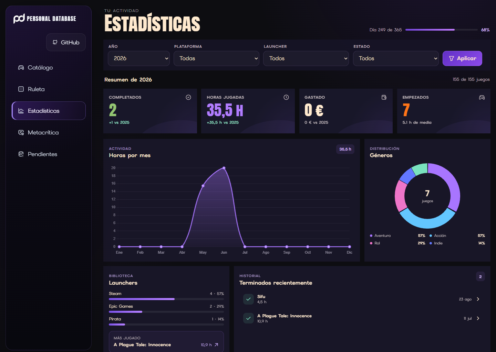 |

#### Desviación observable

- El catálogo presenta una cabecera grande y redondeada que ocupa todo el ancho, mientras que las demás rutas usan una barra lateral de altura completa y otra marca.
- La ficha de juego abandona tanto la barra lateral como la navegación inferior compartida.
- A 820 px se activa la navegación móvil aunque el contenido mantiene densidad de tablet; en Ruleta, Estadísticas, Metacrítica y Pendientes la barra queda encima de controles o filas.
- La jerarquía de título, eyebrow, métricas y acciones cambia de orden y escala por ruta.

#### Fuente normativa

- Patrón operativo dominante: `Sidebar.astro`, `.shell-app`, `.desktop-main` y `.mobile-bottom-nav` ya son infraestructura compartida.
- `theme.css`: `--theme-black`, `--theme-white`, `--theme-purple`, `--line`, `--surface*` y las familias tipográficas actuales.
- Dirección futura, no normativa todavía: `DESIGN.md` define una geometría estable de `AppShell` para todas las escenas.

#### Cambio visual propuesto

- Sidebar desktop de 248 px, fija en la composición y consistente en todas las rutas.
- App header horizontal compacto, sin competir con el título de página.
- `PageHeader` dentro del contenido: eyebrow opcional, un único `h1`, métricas y acciones alineadas.
- Tablet conserva contenido de dos columnas cuando cabe, pero reserva el espacio inferior de navegación de forma centralizada.
- La ficha se integra en el mismo shell; su hero sigue siendo especial, no su navegación global.

#### Mockup corregido — **PROPUESTA**

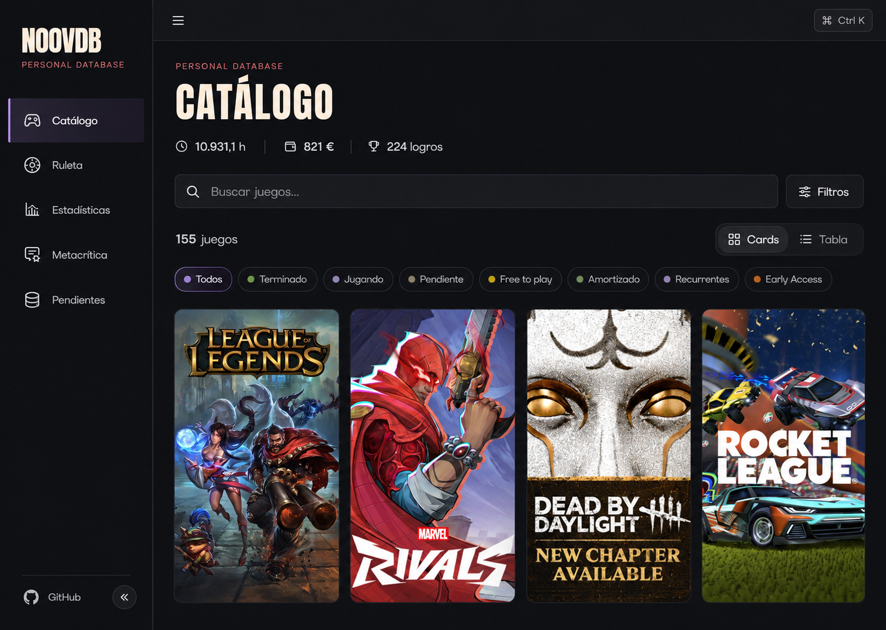

#### Indicaciones técnicas

- Centralizar el wrapper en `BaseLayout.astro` y `Sidebar.astro`; las páginas solo declaran `active`, título, métricas y contenido.
- Extraer, cuando se implemente, un `PageHeader.astro` actual que consuma tokens de `theme.css`; no activar aún las fuentes ni los tokens futuros de `DESIGN.md`.
- Definir una sola variable de clearance, por ejemplo `--mobile-nav-clearance`, y aplicarla al contenedor scrollable: `padding-block-end: calc(var(--mobile-nav-clearance) + env(safe-area-inset-bottom))`.
- Consolidar las reglas duplicadas de `.mobile-bottom-nav` hoy repartidas entre `app-foundation.css`, `app-mobile.css` y `app-responsive.css`.
- Seleccionar dos breakpoints de composición principales —móvil y shell desktop— y reservar excepciones solo para widgets que demuestren una necesidad real.

**Prioridad:** Alta para A1 / Media para M3. **Esfuerzo:** L.

### 5.2 Controles, filtros, vacío, diálogo y carga — M1, M5, B2

#### Captura actual

| Filtros | Vacío móvil | Diálogo de autenticación |
|---|---|---|
| 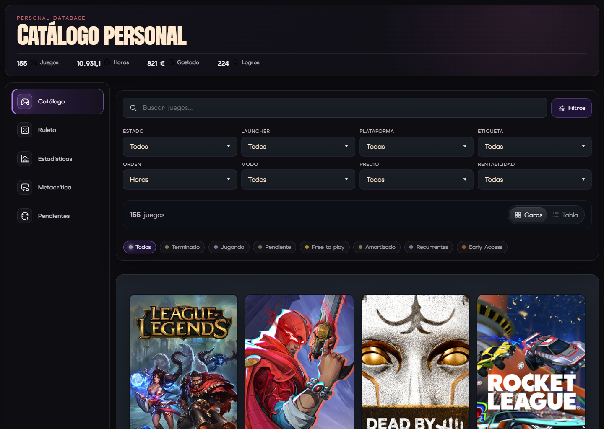 | 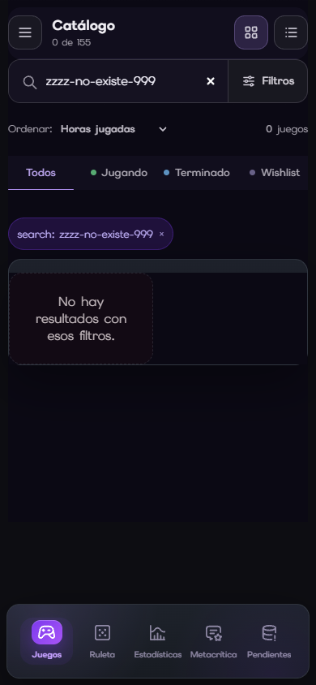 | 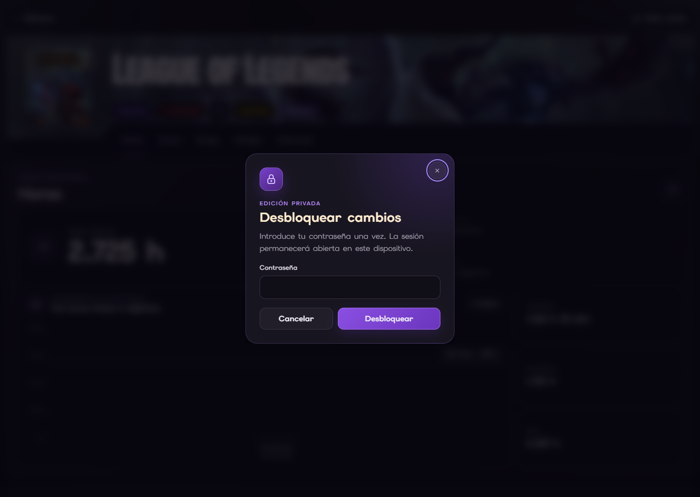 |

#### Desviación observable

- El catálogo combina selectores avanzados, chips de estado, un botón de filtros y más de una lectura del total. La redundancia compite con el contenido.
- El vacío actual deja una superficie grande con un mensaje pequeño y sin una acción primaria clara.
- No existe un contrato visual compartido para portadas pendientes, guardado en curso o error recuperable.
- El diálogo de autenticación sí tiene buena jerarquía, foco visual y acciones comprensibles. Cambiar su lenguaje empeoraría la consistencia.

#### Fuente normativa

- `theme.css`: acento violeta para interacción, superficies oscuras, blanco cálido y radios de anidación.
- Patrón dominante comprobado: el diálogo usa una jerarquía más clara que los paneles de filtro y debe servir como referencia operativa.
- `DESIGN.md` futuro exige controles provenientes de tokens y altura táctil de 44 px; aquí se adopta la accesibilidad del tamaño, no su nueva paleta o tipografía.

#### Cambio visual propuesto

- Una barra primaria con búsqueda, botón “Filtros” y un único total.
- Chips como resumen/atajo, no como un segundo formulario completo.
- Vacío centrado, compacto y accionable: “Limpiar filtros” como acción principal.
- Esqueleto estático solo para slots cuyo tamaño ya está reservado; sin shimmer para evitar ruido y respetar movimiento reducido.
- Guardado con botón deshabilitado, progreso localizado y error recuperable sin bloquear toda la aplicación.

#### Mockups corregidos — **PROPUESTA**

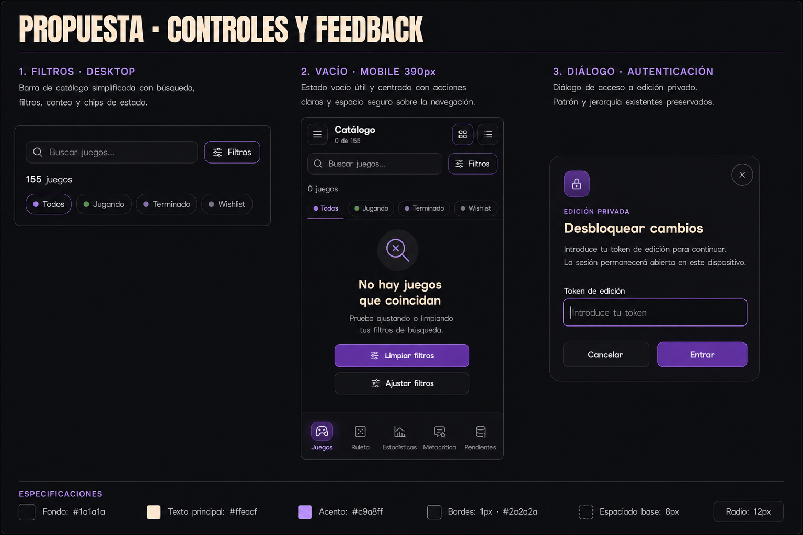

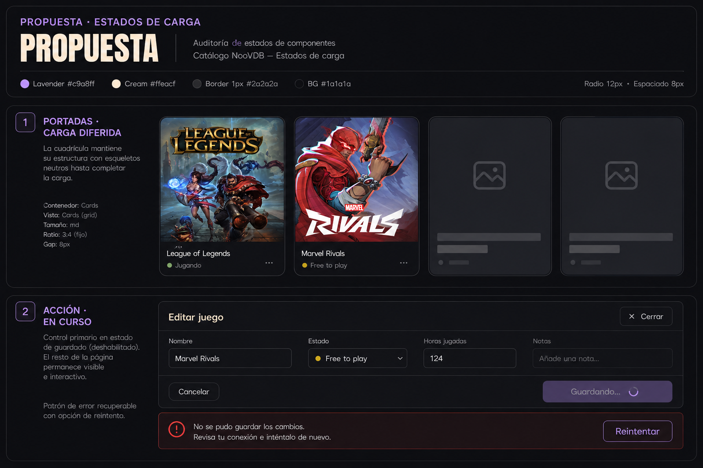

#### Indicaciones técnicas

- Mantener un único estado de filtros en `catalog.ts` y derivar de él selects, chips y total; ningún control debe representar una selección diferente.
- Crear variantes compartidas de `EmptyState`, `InlinePending` y `RecoverableError`; no introducir un overlay de carga de página completa para operaciones locales.
- Preservar el diálogo existente y extraer únicamente sus decisiones repetibles: ancho máximo, header, label/input, fila de acciones y `:focus-visible`.
- Reservar el espacio de las portadas con el mismo `aspect-ratio` de la card para eliminar layout shift.
- En `prefers-reduced-motion`, los placeholders no deben usar barridos, pulsos continuos ni shimmer.

**Prioridad:** Media para M1/M5; Baja para B2. **Esfuerzo:** M.

### 5.3 Game Card estándar y Golden — A3, A5

#### Captura actual

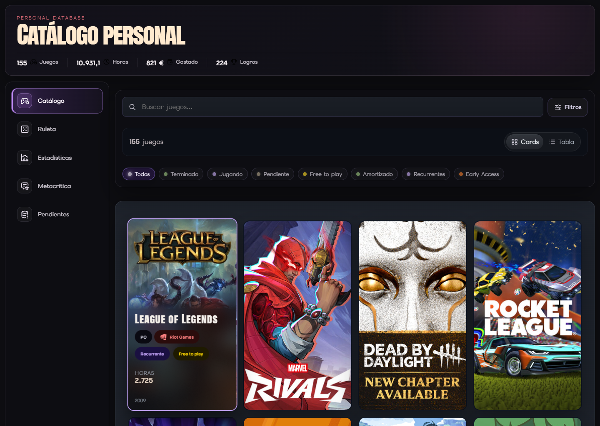

| Golden: arriba izquierda | Golden: centro | Golden: abajo derecha |
|---|---|---|
| 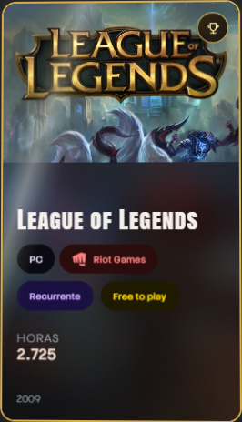 | 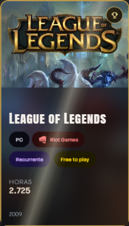 | 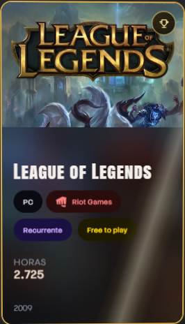 |

Las tres capturas Golden son estados técnicos forzados en Chromium. `games.json` contiene 155 juegos, pero ninguno cumple actualmente `logros.total > 0 && logros.actual >= logros.total`; por tanto no se presentan como datos reales.

#### Desviación observable

- La inclinación ya sigue al puntero y el escalado `1.012` es contenido.
- No existe zoom independiente de la portada; esta decisión actual debe conservarse.
- El brillo Golden es una única banda lineal de 28% de ancho. La idea del haz es adecuada, pero una sola reflexión produce poco destello y carece de los reflejos secundarios que dan sensación de foil físico.
- `pointerX/pointerY` gobiernan tilt y traslación del haz, pero todavía no coordinan un haz principal, dos reflexiones menores, la sombra y el borde como un único sistema óptico.
- En ciertos estados vuelve a percibirse un corte horizontal entre portada y cuerpo, aunque `theme.css` ya define `--card-body-fade: 36px` y `cards.css` documenta expresamente una transición sin línea dura.

#### Fuente normativa

- Implementación actual: `src/scripts/card-tilt.ts` limita el giro a `2.4deg`, usa `requestAnimationFrame`, una única card activa y desactiva el efecto en táctil o movimiento reducido.
- Implementación actual: `src/styles/card-tilt.css` aplica `scale(1.012)` y un haz lineal con `mix-blend-mode: screen`.
- `theme.css`: `--card-body-fade`, `--card-glass`, `--card-radius` y `--gold`.
- Referencia óptica: [Holographic Name Card](https://codepen.io/simeydotme/pen/wvOYJKg) para posición normalizada y coherencia entre inclinación y reflejo; [Multi-Card Glow Hover](https://codepen.io/simeydotme/pen/gOZRrwb) como control de intensidad. La recopilación procede de [FreeFrontend](https://freefrontend.com/javascript-holographic-effect/). No se adopta su lavado iridiscente de superficie completa.

#### Cambio visual propuesto

- Mantener inclinación máxima `±2.4deg` y escala `1.012` sobre la card completa.
- Una única lectura normalizada del puntero alimenta inclinación, sombra, borde y los tres haces.
- Reflejo Golden compuesto exactamente por:
  1. un haz principal ancho, de caída suave y núcleo blanco/dorado intenso;
  2. un segundo haz estrecho y menos opaco;
  3. un tercer haz todavía más fino, separado del anterior;
  4. franjas cromáticas cyan/magenta muy finas solo en los bordes de los haces.
- Los tres haces comparten ángulo y posición de origen. Se mueven simultáneamente, con pequeñas diferencias de parallax espacial, pero sin retraso temporal visible.
- El haz principal ocupa aproximadamente 35–42% del ancho de la card; los secundarios, 7–9% y 3–5%. La zona ajena al reflejo conserva contraste y color originales.
- Sin barrido preprogramado, keyframes automáticos ni reproducción única al entrar.
- Retorno al centro y desaparición en 220–280 ms.
- Borde dorado y distintivo permanecen en táctil y `prefers-reduced-motion`; se elimina el material dinámico.
- Transición portada/cuerpo con fade real de 36–48 px, sin borde superior visible.

#### Hoja de estados corregida — **PROPUESTA**

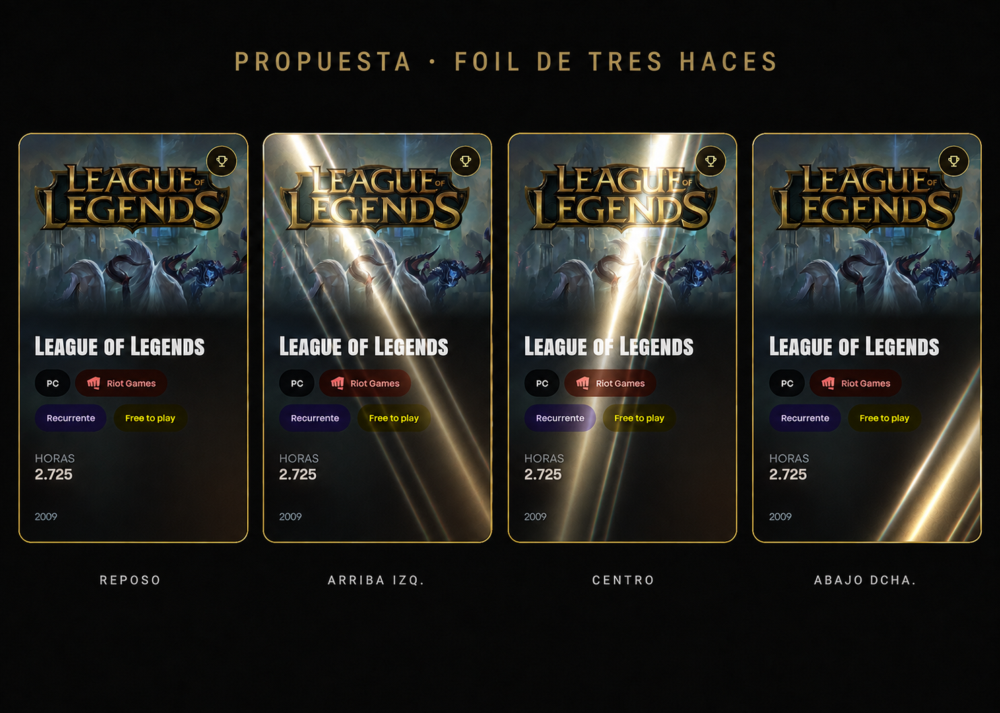

#### Indicaciones técnicas

- Conservar el cálculo normalizado actual de `card-tilt.ts` y publicar dos variables canónicas, por ejemplo `--pointer-x` y `--pointer-y` en rango `[-1, 1]`.
- Derivar el resto en una sola actualización `requestAnimationFrame`; no añadir listeners por card.
- Mantener `activeCard` como exclusión mutua. Al cambiar de card, limpiar todas las variables ópticas de la anterior.
- Sustituir el único `::after` lineal por un elemento o capa dedicada al material, para no competir con `card-body::before` y su textura.
- Componer los tres haces dentro de una sola capa con gradientes lineales paralelos. El principal lleva una caída amplia; cada secundario tiene su propio ancho, offset y opacidad.
- Usar el mismo desplazamiento base derivado del puntero y multiplicadores espaciales próximos —por ejemplo `1`, `0.86` y `0.72`— para que las reflexiones respiren sin separarse de la fuente luminosa. No interpolar cada haz con un retraso diferente.
- Mantener el ángulo común cercano a `-18deg`; las pequeñas franjas cyan/magenta solo perfilan el núcleo, no cubren la superficie.
- Separar tiempos: seguimiento directo de 70–100 ms y settle de 220–280 ms al abandonar. Una clase `is-tracking` permite distinguir ambos estados.
- La sombra debe desplazarse en dirección contraria al puntero y permanecer por debajo de la card; el foil no debe alterar contraste de título, badges o metadatos.
- Corregir la unión de la portada asegurando solape del `card-body` sobre el cover y una máscara/gradiente con fallback; evitar cualquier `border-top` visible.
- Validar cuatro capturas estáticas —reposo, centro y dos esquinas opuestas— y luego una inspección en movimiento a 60 Hz.

No se ha copiado código ni assets de las demos externas. El mockup reinterpreta el comportamiento con la portada y los tokens de NooVDB.

**Prioridad:** Alta. **Esfuerzo:** M para el foil; S para el fade.

### 5.4 Ficha de juego y módulos de contenido — M4, A5

#### Captura actual

| Desktop | Tablet | Móvil |
|---|---|---|
| 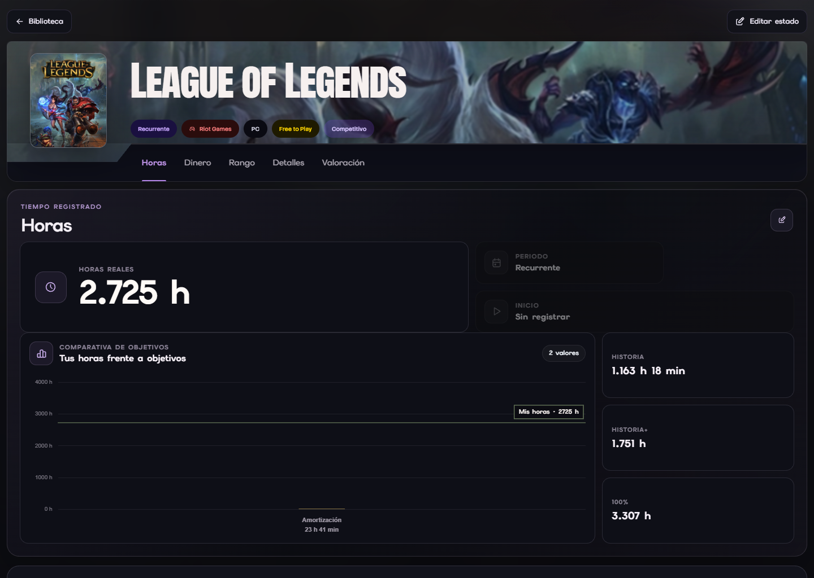 | 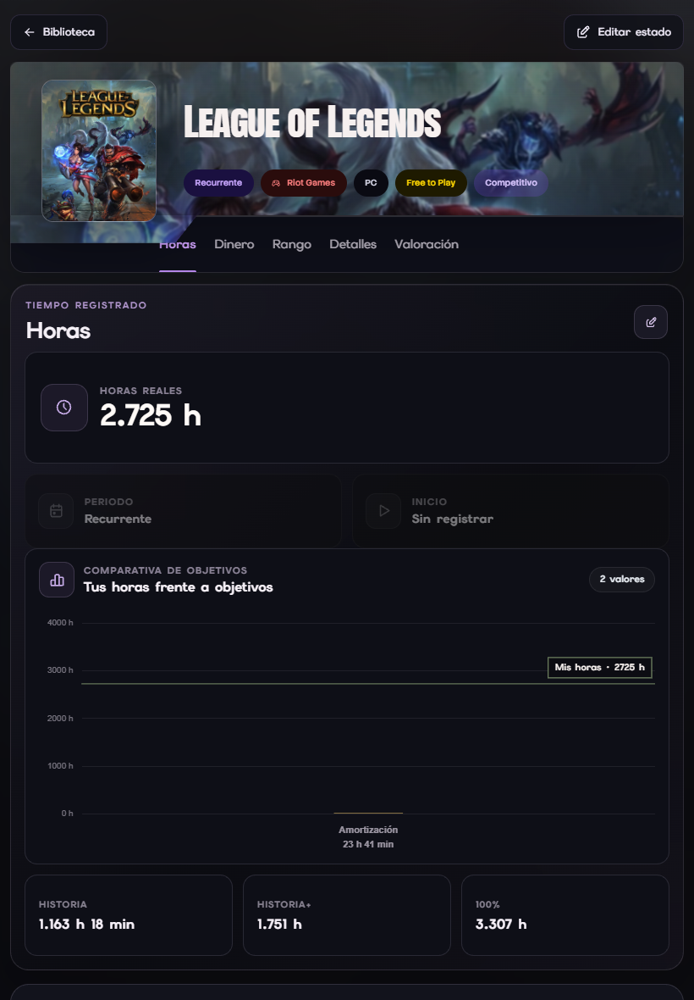 | 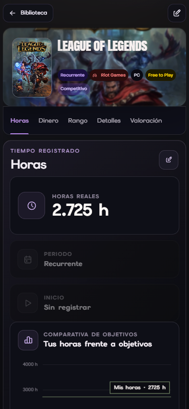 |

| Horas | Dinero | Rango |
|---|---|---|
| [captura actual](docs/design-standardization/assets/37-detail-hours-current.png) | [captura actual](docs/design-standardization/assets/38-detail-finance-current.png) | [captura actual](docs/design-standardization/assets/39-detail-rank-current.png) |

| Detalles | Valoración |
|---|---|
| [captura actual](docs/design-standardization/assets/40-detail-technical-current.png) | [captura actual](docs/design-standardization/assets/41-detail-rating-current.png) |

#### Desviación observable

- La ficha tiene una composición bento más madura que el resto de la aplicación. Esa asimetría es una firma visual obligatoria, no ruido que deba eliminarse.
- La primera propuesta de esta auditoría aplanaba Horas y convertía sus módulos en filas y separadores. Esa dirección queda descartada porque elimina el protagonismo del bento.
- El problema real es que la ficha funciona como una aplicación separada: navegación, cabecera y márgenes son propios. Unificar el shell no autoriza a uniformar sus widgets.
- En tablet la línea entre hero y navegación se percibe abrupta.
- Horas y Dinero ya tienen una jerarquía clara de módulos grandes y pequeños. Rango, Detalles y Valoración deben reforzar el mismo principio, evitando que sus contenidos se conviertan en una única banda o en tarjetas idénticas.
- Las acciones de edición cambian de ubicación entre viewports sin un patrón global claro.

#### Fuente normativa

- Requisito de producto confirmado: el bento debe ser protagonista en **todas** las áreas de la ficha —Horas, Dinero, Rango, Detalles y Valoración—.
- `theme.css`: regla explícita de radios descendentes por nivel de anidación.
- Patrón dominante comprobado: `frosted-bento.css`, `flat-blocks.css`, `finance.css`, `competitive.css` y `experience.css` ya contienen grids y spans reutilizables.
- Patrón dominante de la ficha: navegación interna y edición contextual son útiles y deben conservarse.
- Dirección futura: `WidgetFrame` y `AppShell` confirman una composición por widgets, pero su implementación pertenece a la migración posterior.

#### Cambio visual propuesto

- Integrar la ficha en el shell compartido.
- Hero especial con una transición vertical oscura de 72–96 px hacia el contenido, sin corte horizontal.
- Mantener una retícula bento de 12 columnas en desktop. Cada sección contiene como mínimo un módulo protagonista, uno o dos módulos de apoyo y celdas secundarias con spans deliberadamente distintos.
- Horas: cifra principal y gráfico dominantes; periodo, inicio y objetivos como módulos de apoyo.
- Dinero: meta económica y rentabilidad dominantes; costes, horas ponderadas, excedente y gasto como módulos secundarios.
- Rango: Peak ELO como pieza protagonista; contexto competitivo en celdas menores cuando exista.
- Detalles: Progreso, Catalogación, Mi copia e Información técnica conservan tamaños distintos según importancia.
- Valoración: bloque de notas externas, desglose personal y comentario forman tres escalas diferentes, no una cuadrícula uniforme.
- En móvil, el bento se convierte en una secuencia ordenada: protagonista a ancho completo y secundarios en dos columnas cuando el contenido y los targets de 44 px lo permitan.

#### Mockup corregido — **PROPUESTA**

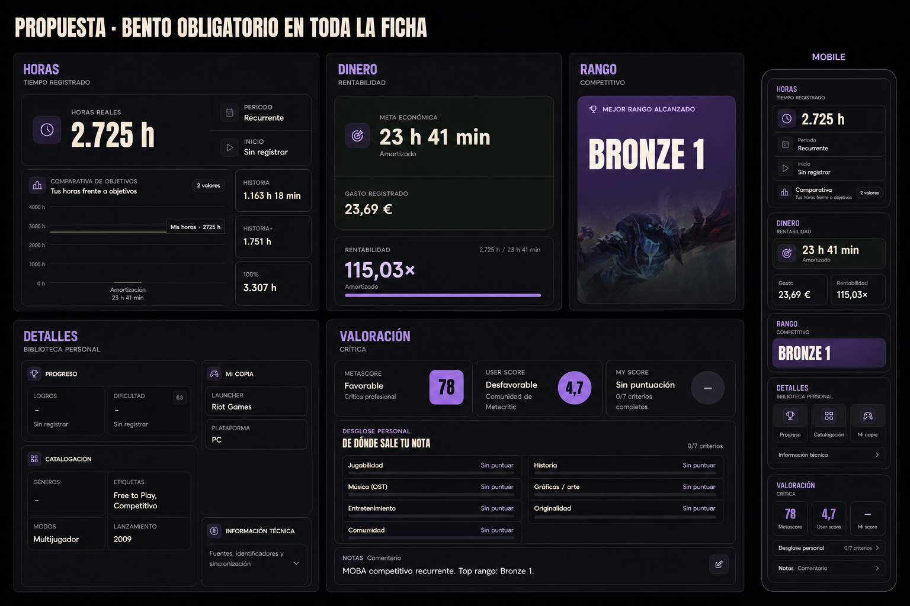

#### Indicaciones técnicas

- Montar la página dentro del mismo wrapper de `BaseLayout`/`Sidebar` que el resto de escenas.
- Aplicar el fade en la capa del hero o en un pseudo-elemento al final de la imagen, no como una franja sólida del contenido.
- Definir una primitiva compartida de grid, por ejemplo `.game-bento-grid`, y variantes de span semánticas como `is-hero`, `is-wide`, `is-tall` e `is-compact`; no codificar coordenadas distintas en cada página.
- Mantener la regla de radios por nesting: el frame de sección puede contener cards bento visibles siempre que los radios y bordes reduzcan jerárquicamente.
- No imponer el mismo número de columnas internas a las cinco secciones. La consistencia procede del ritmo, los spans y la jerarquía, no de hacer todas las cards iguales.
- En móvil, declarar el orden de lectura en el DOM y usar CSS Grid solo para reagrupar secundarios; la lectura accesible no debe depender de la posición visual.
- Unificar el tamaño y posición de los botones de edición con la variante de icon button del diálogo/editor.
- Mantener los gráficos con fondo neutro y usar el color funcional solo en series, objetivos y leyenda.

**Prioridad:** Media para sistematizar el bento; el corte de imagen es Alta por ser una regresión visual evidente. **Esfuerzo:** M.

### 5.5 Widgets de datos, métricas y gráficos — M2, B1

#### Captura actual

| Desktop | Tablet | Móvil |
|---|---|---|
|  | 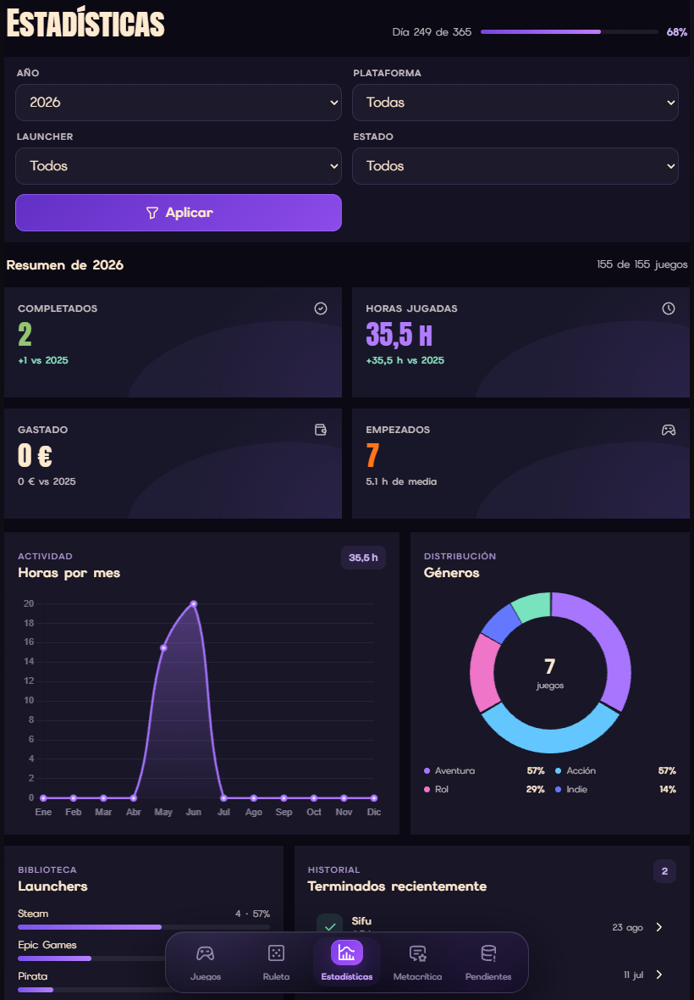 | 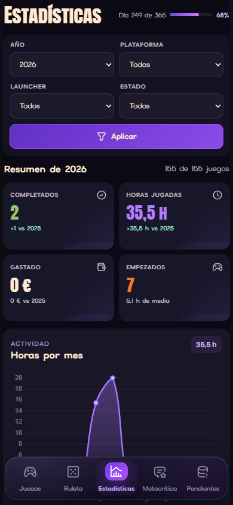 |

#### Desviación observable

- “Completados”, “Horas”, “Gastado” y “Empezados” usan verde, violeta, crema y naranja como cuatro identidades visuales equivalentes.
- Los colores funcionales de `theme.css` están pensados para estados y categorías, pero en métricas se usan también como decoración ambiental.
- Valores, etiquetas, comparativas e iconos no mantienen siempre la misma línea base ni jerarquía.
- Los gráficos son legibles, aunque cada panel decide densidad, leyenda y tratamiento del color de manera local.

#### Fuente normativa

- `theme.css`: violeta como acento principal y colores adicionales reservados a estados/categorías.
- Regla operativa de claridad: números principales deben dominar sobre etiqueta, periodo y comparación.
- Dirección futura: `DESIGN.md` reserva cifras tabulares y componentes `Metric`/`ProgressBar`; no se activan aún sus fuentes.

#### Cambio visual propuesto

- Métricas neutrales por defecto; violeta para selección o dato protagonista.
- Verde/rojo solo para delta positivo/negativo, naranja para advertencia real.
- Misma estructura interna: label, value, context/delta e icono auxiliar.
- Un único estilo de frame, título, plot area, eje y leyenda para líneas, barras y donuts.

#### Mockup corregido — **PROPUESTA**

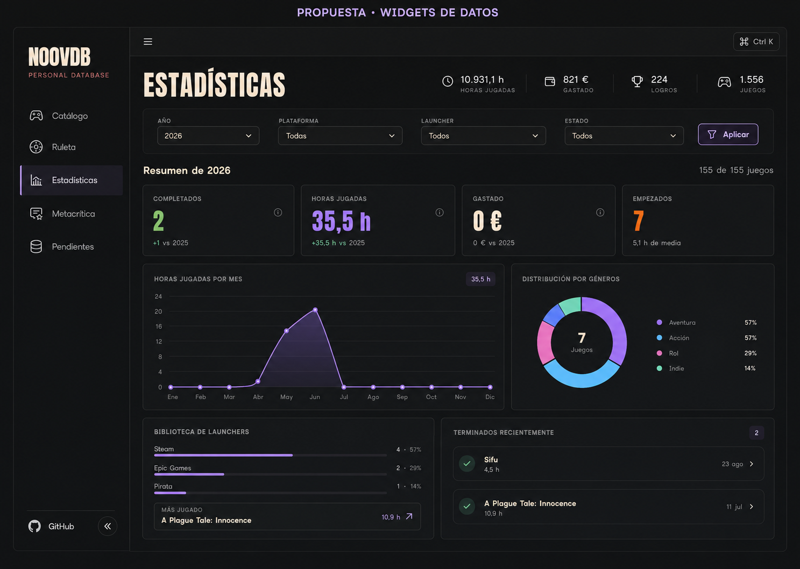

#### Indicaciones técnicas

- Extraer variantes compartidas `Metric`, `ChartFrame`, `Legend` y `ProgressBar` cuando comience la implementación.
- Añadir `font-variant-numeric: tabular-nums` a valores, porcentajes y dinero sin cambiar todavía las fuentes actuales.
- Definir una escala tipográfica operativa corta en `theme.css` y reemplazar gradualmente las 158 variantes detectadas.
- Mantener paletas de series en tokens funcionales y documentar el orden de reutilización para que un color represente la misma serie en todos los gráficos.
- Alinear títulos, filtros y conteos con el `PageHeader` y la barra de controles compartidos.

**Prioridad:** Media. **Esfuerzo:** M.

### 5.6 Listas de mantenimiento y Datos pendientes — A2

#### Captura actual

| Desktop | Tablet | Móvil |
|---|---|---|
| 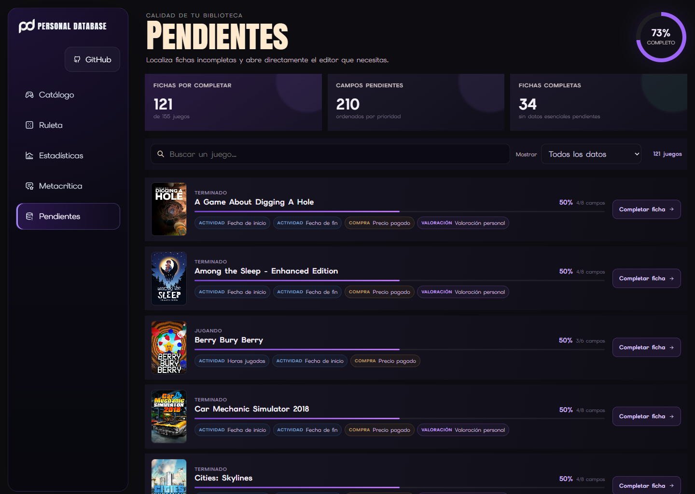 | 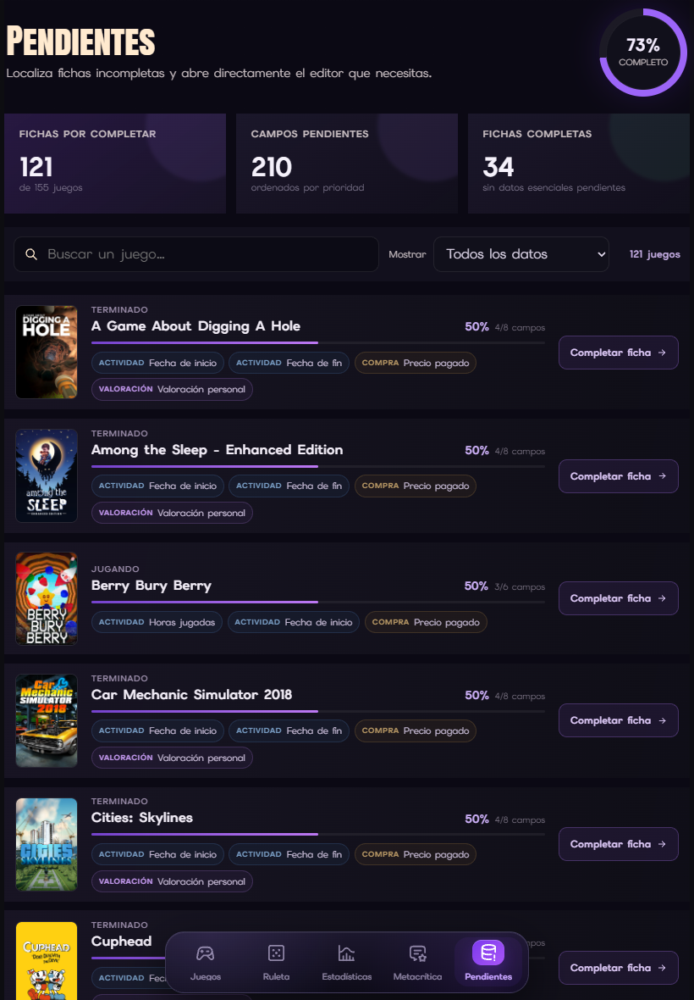 | 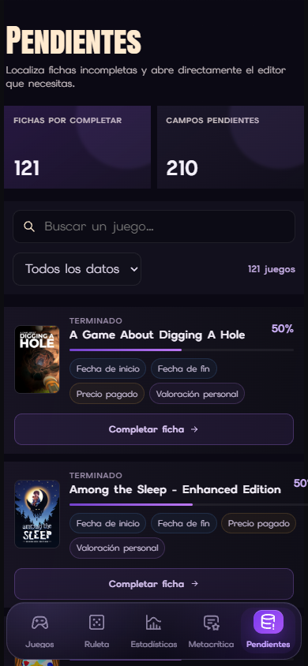 |

#### Desviación observable

- En 390 px el porcentaje de progreso queda cortado en el borde derecho en varias filas.
- Título, porcentaje, campos pendientes y acción compiten dentro del mismo eje horizontal.
- La barra inferior fija cubre parte de la última fila visible en tablet y móvil.
- El barrido automatizado con axe-core 4.12.1 encontró una infracción crítica `select-name`: el selector “Todos los datos” no tiene `label`, `aria-label` ni `aria-labelledby`.
- La comprobación de contraste quedó incompleta en fondos con pseudo-elementos o gradientes; no puede darse por aprobada de forma automática.

#### Fuente normativa

- HTML accesible: todo `select` necesita un nombre programático.
- `theme.css`: controles y estados deben mantener contraste sobre superficies oscuras.
- Patrón móvil dominante: portada, título y acción deben reordenarse, no comprimirse hasta recortar contenido.

#### Cambio visual propuesto

- Desktop conserva densidad de tabla/lista.
- Móvil usa filas de una columna lógica: portada + título; debajo progreso/porcentaje; acción completa o alineada al final.
- Porcentaje siempre visible y barra flexible con `min-width: 0` en el bloque de texto.
- 44 px mínimos en la acción “Completar ficha”.
- Clearance inferior uniforme y navegación dentro del safe area.

#### Mockup corregido — **PROPUESTA**

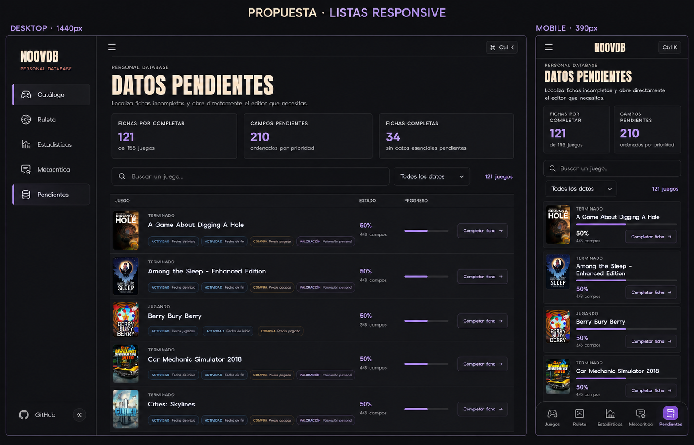

#### Indicaciones técnicas

- Asociar un `<label for>` visible o `aria-label="Filtrar por tipo de dato"` al `select[data-pending-category]`.
- En `data-pending.css`, asegurar `min-width: 0` en el primer hijo de `.data-game-head`; permitir truncado o wrap del título antes de comprimir `.data-game-score`.
- En `max-width: 430px`, separar visualmente el score del título mediante grid o una segunda fila, en vez de mantener `justify-content: space-between` a cualquier coste.
- Aplicar la variable global de clearance del shell; eliminar compensaciones locales que divergen entre páginas.
- Medir manualmente contraste de etiquetas pequeñas y estados sobre el gradiente antes de aceptar el cambio.

**Prioridad:** Alta. **Esfuerzo:** S para el bug y el nombre accesible; M para normalizar toda la familia.

### 5.7 Ruleta y Metacrítica — aplicación de patrones, no rediseño propio

#### Captura actual

| Ruleta tablet | Metacrítica tablet |
|---|---|
| 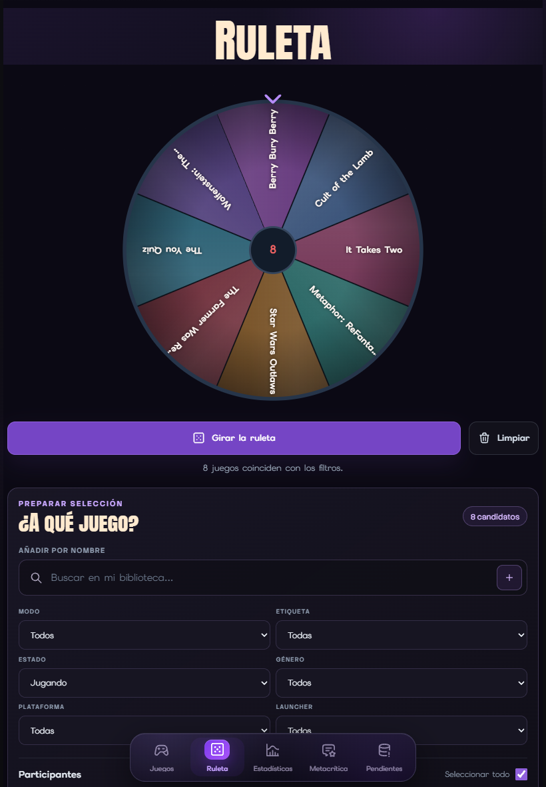 | 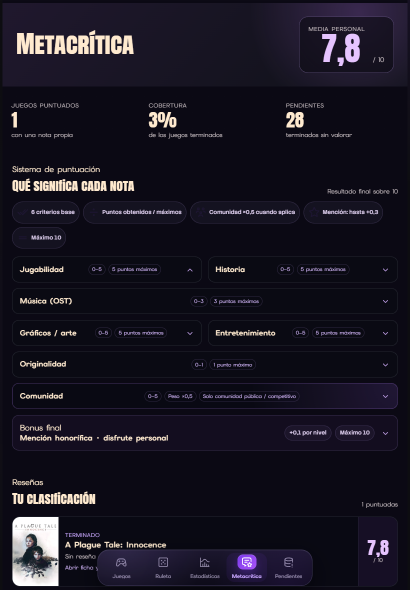 |

#### Evaluación

- La ruleta ya tiene un protagonista claro y una acción primaria inequívoca. No necesita otro lenguaje visual; necesita el shell común, clearance inferior y simplificación de superficies alrededor de filtros.
- Metacrítica tiene buena jerarquía editorial y una fórmula comprensible. Debe adoptar el `PageHeader`, la escala de métricas y los controles compartidos sin perder su contenido.
- `/criterio/` ya es un alias 301; mantenerlo así evita duplicidad de UI y SEO.

#### Mockups aplicables — **PROPUESTA**

Estas rutas no requieren una propuesta visual exclusiva. Su corrección queda representada por el [shell común](docs/design-standardization/assets/26-catalog-shell-proposed.png), los [widgets de datos](docs/design-standardization/assets/27-data-widgets-proposed.png) y los [controles compartidos](docs/design-standardization/assets/29-controls-feedback-proposed.png). Crear otra estética para ellas reproduciría el problema que esta auditoría intenta resolver.

#### Indicaciones técnicas

- Mantener los componentes específicos —wheel, metodología, acordiones y ranking— dentro del frame compartido.
- Aplicar la misma escala de página, separación entre secciones y tratamiento de métricas.
- Reducir halos/fondos decorativos donde no comuniquen estado.
- Verificar que la navegación fija no cubre “Participantes”, reseñas o acciones a 820 y 390 px.

**Prioridad:** Media. **Esfuerzo:** M.

## 6. Correcciones actuales frente a migraciones futuras

No deben mezclarse. Aplicar ahora la paleta o fuentes futuras obligaría a juzgar simultáneamente estructura, marca y comportamiento, y haría imposible saber qué cambio mejora realmente el producto.

| Aplicable al diseño actual | Migración futura definida en `DESIGN.md` |
|---|---|
| Corregir clipping, safe area y nombres accesibles. | Autohospedar Caacupé y Geist Sans. |
| Mantener Anton SC, Elms Sans y Stack Sans Text. | Sustituir la escala actual por `--ds-font-*` y `--ds-type-*`. |
| Unificar shell y `PageHeader` con `--theme-black`, `--theme-white` y `--theme-purple`. | Crear `tokens.css` con la paleta `--ds-*`. |
| Convertir colores/radios repetidos en aliases de `theme.css`. | Adoptar `WidgetFrame`, `Metric`, `ProgressBar`, `AppShell` y `AppHeader` definitivos. |
| Sistematizar el bento de toda la ficha sin aplanar sus módulos ni alterar datos o IA. | Introducir frost, ambient light y presets de movimiento aprobados. |
| Rehacer Golden con puntero normalizado y fallback reducido. | Mapear el foil a `--ds-foil-*` cuando esos tokens sean normativos. |
| Conservar el diálogo actual como patrón. | Crear `/design-system` y pruebas visuales contra el mockup aprobado. |

## 7. Plan recomendado de implementación posterior

### Fase A — defectos verificables

1. Corregir `select-name`, clipping de Pendientes y clearance de navegación.
2. Restaurar el fade imagen/superficie en cards y hero.
3. Sustituir el haz Golden por el material ligado al puntero.
4. Añadir pruebas visuales en 390, 820 y 1440 para esos cambios.

### Fase B — estandarización con tema actual

1. Unificar shell, marca, app header y page header.
2. Normalizar controles, vacío, carga, error y diálogo.
3. Extraer métricas, chart frames, primitivas bento, listas y acciones compartidas.
4. Migrar valores literales a tokens actuales por dominio, no mediante una reescritura global de una vez.

### Fase C — decisión y migración de `DESIGN.md`

1. Aprobar o rechazar el mockup de catálogo.
2. Solo si se aprueba: crear aliases `--ds-*`, instalar fuentes locales y construir el inventario de componentes.
3. Migrar ruta por ruta mediante comparación visual, sin parches locales para compensar tokens incorrectos.

## 8. Matriz final de consistencia

| Área | Estado actual | Criterio de aceptación |
|---|---|---|
| Color | **Bajo**: identidad base clara, demasiados literales y usos decorativos de colores funcionales. | Todo color nuevo procede de `theme.css`; semántica estable entre rutas. |
| Tipografía | **Medio**: familias coherentes, escala excesivamente fragmentada. | Display/UI/badge respetan su rol; escala corta y cifras tabulares. |
| Espaciado | **Bajo**: cada dominio recompone gaps y padding. | Ritmo base compartido; excepciones justificadas por widget. |
| Radios | **Bajo**: 40 valores frente a una regla de anidación ya documentada. | Radio decrece con nesting; pills/círculos son únicas excepciones. |
| Bordes | **Medio**: generalmente sobrios; la ficha usa nesting bento legítimo, pero no siempre sistematizado. | El bento puede anidar módulos visibles si borde y radio reducen jerárquicamente; fuera de él, usar separadores antes que otra caja. |
| Jerarquía | **Bajo**: títulos, marca y métricas cambian por ruta. | Un `PageHeader` y un orden común de título, contexto, métricas y acción. |
| Responsive | **Bajo**: clipping y nav superpuesta; demasiadas media queries. | Sin overflow a 390; sin overlays a 820; shell estable a 1440. |
| Estados | **Medio**: hover y diálogo bien encaminados; vacío/carga/error incompletos. | Rest, hover, focus, disabled, empty, loading, error y reduced motion documentados. |
| Movimiento | **Medio**: tilt sutil correcto, reflejo Golden insuficiente y settle corto. | Una fuente de puntero, tres haces simultáneos, 60 Hz, settle 220–280 ms y fallback táctil/reducido. |

## 9. Accesibilidad y límites de la validación

- Se ejecutó un barrido automatizado WCAG A/AA con axe-core 4.12.1 sobre las rutas principales.
- Catálogo, ficha, Ruleta, Estadísticas y Metacrítica no devolvieron infracciones automáticas en las capturas de referencia, aunque sí comprobaciones de contraste incompletas por fondos translúcidos, gradientes o pseudo-elementos.
- Datos pendientes en móvil devolvió una infracción crítica: `select[data-pending-category]` sin nombre accesible.
- La automatización no sustituye revisión manual de contraste, foco, orden de tabulación, lectores de pantalla, zoom a 200% ni interacción táctil.
- Por tanto, este documento no afirma conformidad WCAG completa.

## 10. Limitaciones y procedencia de los mockups

- Los mockups se generaron como propuestas visuales a partir de capturas locales inspeccionadas y de los valores actuales de `theme.css`.
- Las etiquetas, pequeñas cifras y contenido de un mockup pueden contener simplificaciones; el contenido real del repositorio sigue siendo la fuente funcional.
- El CodePen completo de la referencia Golden quedó bloqueado por verificación antibot. Se inspeccionaron la miniatura pública y el código fuente accesible; no se copió ninguno de los dos al repositorio.
- Ninguna imagen externa de FreeFrontend o CodePen está incluida en `docs/design-standardization/assets/`.

### Brief aplicado a cada propuesta

| Archivo | Objetivo |
|---|---|
| [43-golden-three-beam-proposed.png](docs/design-standardization/assets/43-golden-three-beam-proposed.png) | Mismo juego en reposo, centro y esquinas opuestas; un haz principal y dos secundarios como una sola reflexión. |
| [26-catalog-shell-proposed.png](docs/design-standardization/assets/26-catalog-shell-proposed.png) | Shell desktop común usando la paleta y tipografías operativas. |
| [27-data-widgets-proposed.png](docs/design-standardization/assets/27-data-widgets-proposed.png) | Sistema neutral de métricas, gráficos y leyendas. |
| [28-pending-responsive-proposed.png](docs/design-standardization/assets/28-pending-responsive-proposed.png) | Lista desktop/móvil sin clipping ni solape de navegación. |
| [29-controls-feedback-proposed.png](docs/design-standardization/assets/29-controls-feedback-proposed.png) | Filtros simplificados, vacío accionable y diálogo canónico. |
| [42-game-detail-bento-system-proposed.png](docs/design-standardization/assets/42-game-detail-bento-system-proposed.png) | Sistema bento para Horas, Dinero, Rango, Detalles y Valoración, con adaptación móvil. |
| [31-loading-states-proposed.png](docs/design-standardization/assets/31-loading-states-proposed.png) | Carga diferida estable, guardado localizado y error recuperable. |

## 11. Criterio de cierre de la futura implementación

La estandarización puede considerarse terminada cuando:

- las siete rutas pasan por una única geometría de shell o por el redirect canónico documentado;
- no hay overflow horizontal ni contenido cubierto en 390, 820 y 1440 px;
- todos los controles tienen nombre, foco visible y target táctil adecuado;
- los valores visuales nuevos proceden de tokens;
- la card Golden demuestra coherencia entre puntero, tilt, sombra, borde, haz principal y dos reflejos secundarios en cuatro estados estáticos y en movimiento;
- táctil y `prefers-reduced-motion` conservan significado sin inclinación ni foil dinámico;
- Horas, Dinero, Rango, Detalles y Valoración conservan un bento protagonista en desktop y una jerarquía equivalente en móvil;
- el estado vacío, carga, error y diálogo tienen un patrón compartido;
- el build pasa y la comparación visual se realiza contra los mockups aprobados, no contra interpretaciones locales por página.
